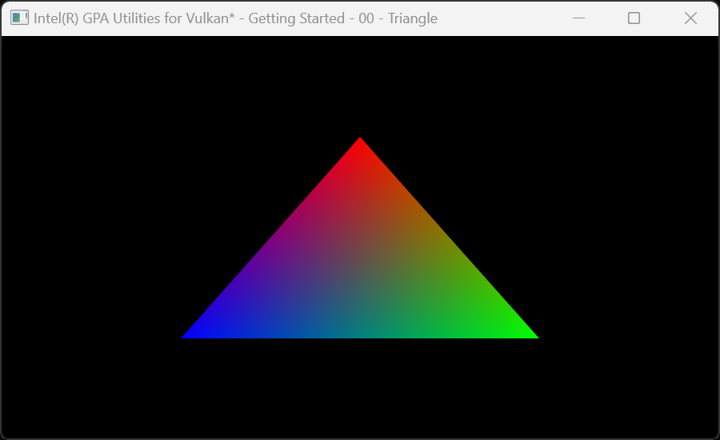
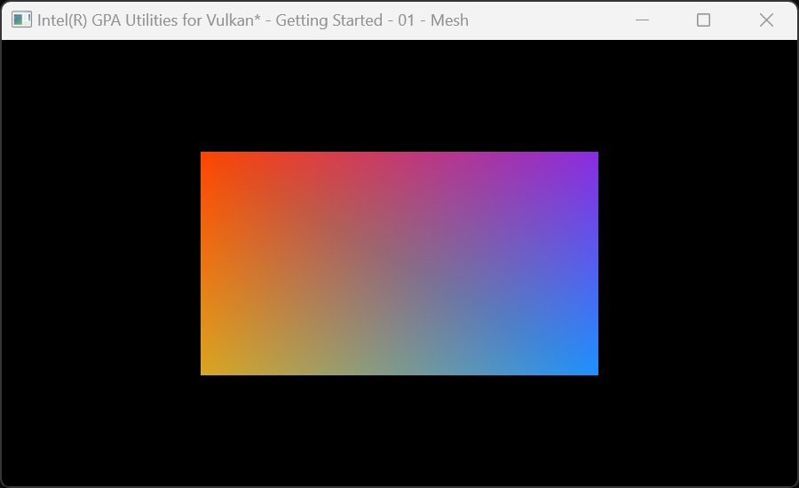
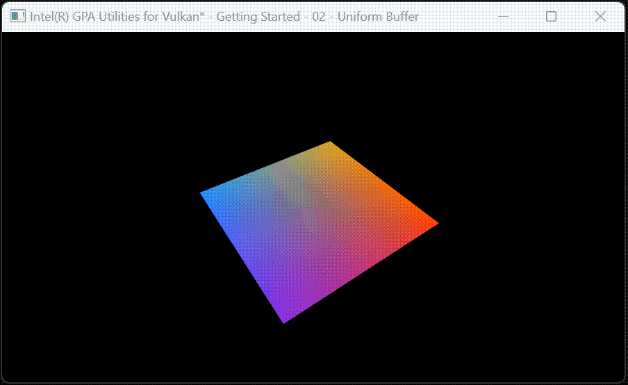
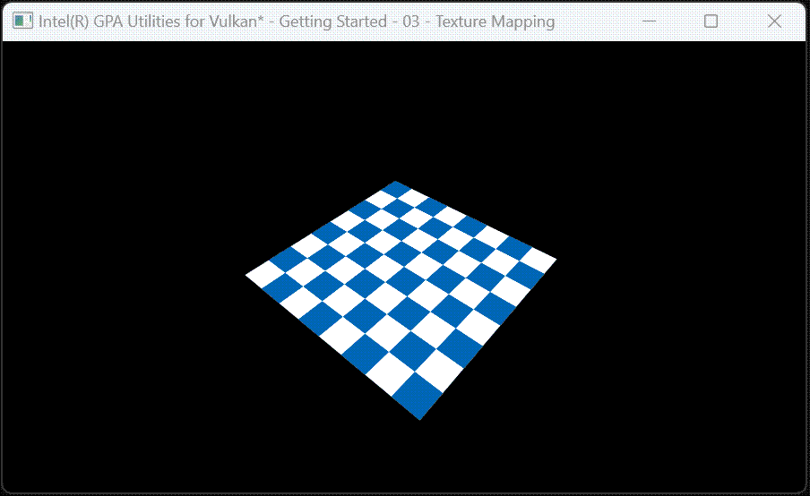
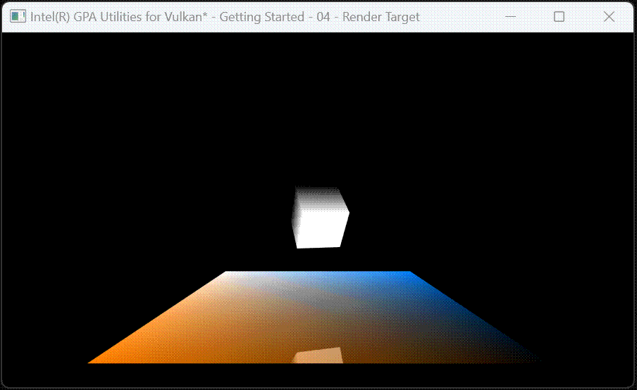
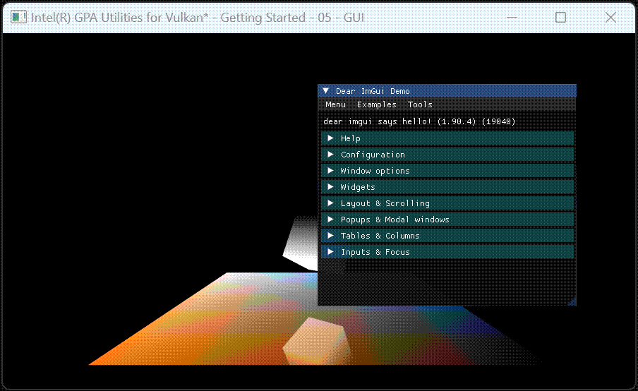

# Intel® Graphics Performance Analyzer Utilities for Vulkan*

A collection of Vulkan C++ utilities with a general focus on tools development, and a specific focus on supporting [Intel Graphics Performance Analyzers Framework](https://intel.github.io/gpasdk-doc/).

# Features
 - Vulkan structure utilities (compare/copy/serialize/stringify)
 - Managed Vulkan handles
 - Managed WSI (Window System Integration)
 - [ImGui](https://github.com/ocornut/imgui) integration
 - SPIR-V compilation via [glslang](https://github.com/KhronosGroup/glslang)
 - SPIR-V reflection via [SPIRV-Cross](https://github.com/KhronosGroup/SPIRV-Cross)
 - [Vulkan Memory Allocator](https://gpuopen.com/vulkan-memory-allocator/) integration
 - Vulkan XML parsing utilities (used to keep the project up to date with the vk.xml)
 - ...and more...

# Samples
[](samples/gvk-getting-started-00-triangle.cpp)
[](samples/gvk-getting-started-01-mesh.cpp)
[](samples/gvk-getting-started-02-uniform-buffer.cpp)
[](samples/gvk-getting-started-03-texture-mapping.cpp)
[](samples/gvk-getting-started-04-render-target.cpp)
[](samples/gvk-getting-started-05-gui.cpp)

# Getting Started
### Install Dependencies
+ ###### Windows 11
Ensure the following tools are installed, for Windows download and install from the provided links...
 - [CMake](https://cmake.org/download/) v3.3+ (Make sure to select "Add to PATH" when prompted)
 - [Git](https://git-scm.com/)
 - [Python](https://www.python.org/downloads/) v3+ (Make sure to select "Add to PATH" when prompted)
 - [Visual Studio](https://visualstudio.microsoft.com/vs/community/) 2022 (Make sure to select "Desktop development with C++" when prompted)
  - [Vulkan SDK](https://vulkan.lunarg.com/sdk/home) v1.3.296.0 (optional, GVK will download the correct version during configuration if necessary)
+ ###### Ubuntu 22.04
```
sudo apt update && sudo apt upgrade
sudo apt install cmake
sudo apt install git
sudo apt install python3
sudo apt install libwayland-dev
sudo apt install libxkbcommon-dev
sudo apt install xorg-dev
```
Configure your environment to use an installed Vulkan SDK  (optional, GVK will download the correct version during configuration if necessary)...
```
source <vulkan/sdk/path>/setup-env.sh
```

### Configure and Build
###### ~15-40 min depending on options/configuration
```
git clone https://github.com/intel/gvk.git
cd gvk
```
+ ###### Windows 11
```
cmake -G "Visual Studio 17 2022" -A x64 -B build
cmake --build build
```
On Windows, a build can be run from the command line using `cmake --build build` or from Visual Studio by opening `gvk/build/gvk.sln`.
To run the first sample, navigate to `gvk/samples/getting-started-00-triangle` in Visual Studio, right click and select "Set as Startup Project", then run the project.
+ ###### Ubuntu 22.04
```
cmake -B build
cmake --build build
./build/samples/gvk-getting-started-00-triangle
```
To use Vulkan SDK layers downloaded at configure time...
```
source build/_deps/vulkan-sdk-src/setup-env.sh
```

# External Use
Somewhere in your CMakeLists, add the following...
```
include(FetchContent)
# Full list of available options can be found in gvk/CMakeLists.txt
set(gvk-build-tests OFF CACHE BOOL "" FORCE) 
FetchContent_Declare(
    gvk
    GIT_REPOSITORY "https://github.com/intel/gvk.git"
    GIT_TAG <desired commit hash>
)
FetchContent_MakeAvailable(gvk)
```
...enabled gvk components and dependencies are avaialable for linking...
```
target_link_libraries(
    someTarget
    PUBLIC
        gvk-gui
        gvk-handles
        gvk-math
        gvk-runtime
        gvk-spirv
        gvk-structures
        gvk-system
        stb
)
```
Note that this list includes redundant entries, for example `gvk-handles` implicitly links `gvk-runtime` and `gvk-structures` so the latter two need not be explicitly listed but are here for illustrative purposes.
